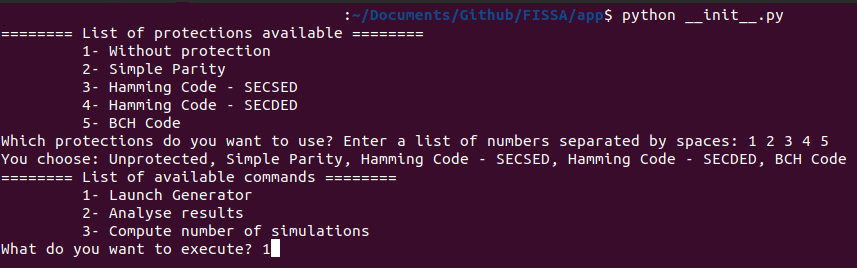

<p align="center">
    
    
    
    <br/>
    
    
    <br/>
    
    <!--  -->

</p>

# FISSA: Fault Injection Simulation for Security Assessment
## Building Fault Injection Scenarios with Ease
---
### Description
FISSA is a tool designed for generating fault injection campaigns in micro-architectures, essential for assessing the security of designs against physical attacks. By deliberately introducing hardware errors into the micro-architecture of processors, FISSA allows users to test their robustness against potential hardware failures.
This open-source tool integrates with existing simulation environment like Questasim, streamlining the process of generating fault injection scenarios.

With FISSA, generating fault injection campaigns becomes more accessible, empowering users to assess the security and reliability of their designs efficiently to enable *Security By Design*.

---
### Installation
#### Setting up python environment
To run FISSA, ensure you have Python 3.10.0 (or more) installed on your system. If needed, you can set up a virtual environment using your preferred method. You can check this documentation if you need : [venv](https://docs.python.org/3/library/venv.html)

After setting up the Python environment, install the required dependencies by running the following command:

```bash
pip3 install -r requirements.txt    
```
This command will install all the necessary dependencies specified in the requirements.txt file.
Once the dependencies are installed, you're ready to use FISSA for generating fault injection campaigns in micro-architectures.

##### Preliminaries
This `README.md` is part of the [repository](git@git@github.com:WilliamPsc/FISSA.git) and should sit in the `FISSA` directory. If it is not, please clone the repository first:
```bash
git clone git@github.com:WilliamPsc/FISSA.git FISSA
cd FISSA
```

At this point, you can define your installation and working directory:
```bash
export FISSA=$pwd
```
If you run `ls $FISSA`, it should return the content of the `FISSA` folder.

---
### Integrating your design inside *FISSA*

#### Generator
This module requires significant adaptations to be applied to your design. It utilises the `TCL`, `CodeExecute`, `FaultInjection`, and `LogData` classes. The primary class, `TCL`, is activated by the `__init__` and `main` modules, and it subsequently calls the others classes:
- `CodeExecute` is responsible for generating basic TCL scripts, which cover tasks such as initialising the simulation (setting up results files, read targets file, and simulation variables), creating the reference simulation, executing simulations step-by-step, and concluding the simulation (either by restarting or exiting the HDL Simulator).
- `FaultInjection` creates TCL scripts for fault injection based on the fault model specified in the configuration file. If a new threat model is introduced in the configuration file, the `FaultInjection` class must be modified to incorporate the new fault model along with its parameters.
- `LogData` develops TCL scripts for the logging aspect, tailored to the fault model. It establishes a common foundation for all fault models, which includes the register file, all targets from the target file, and any additional targets listed in the log_registers section of the configuration file.

#### Integration with HDL Simulator
- Only Questasim and Modelsim are supported.
- Version tested:
  - Questasim 10.6e (June 22, 2018)
  - Modelsim 2022.4

To execute the simulations in an HDL Simulator like Questasim or Modelsim, you have to execute the command in console mode. Here it is an example for the command:
`tcsh -c env\ PULP_CORE=riscv\ VSIM_DIR=vsim_dir\ install_directory_hdl_simulator\ -c\ -64\ -do\ 'source\ init_file.tcl\;\ source\ path_to_tcl_file.tcl\;'\ > vsim.log`

This command sets up and runs a simulation environment for a specific application, capturing all outputs in a log file. 
The command in details:
- `tcsh -c`: This part of the command specifies that the tcsh shell should execute the command that follows the -c option. tcsh is a version of the C shell (csh), and the -c option tells it to execute the string that follows as a command.
- `env PULP_CORE=riscv`: The env command is used to set or print environment variables. In this case, it sets the `PULP_CORE` environment variable to riscv. This environment variable is likely used by the simulation software to specify the core architecture.
- `VSIM_DIR=vsim_dir`: Another environment variable, `VSIM_DIR`, is set to point to the directory where the simulation files are located.
- `install_directory_hdl_simulator -c -64`: This part specifies the path to the vsim executable, which is part of the QuestaSim suite used for hardware simulation. The -c option here tells vsim to run without a GUI, and -64 instructs it to run in 64-bit mode.
- `-do\ 'source\ init_file.tcl\;\ source\ path_to_tcl_file.tcl\;'`: This part uses the `-do` option of vsim, which directs it to execute a series of commands specified in the quoted string. It sources two TCL scripts in sequence: one general script (`init_file.tcl`) and another more specific to the application being simulated.
- `> vsim.log`: Finally, the output of the vsim command (including any outputs from the sourced TCL scripts) is redirected to a file named vsim.log, which will be located in the directory where the command was executed.

#### Analyser
To analyse the data produced by the simulations, a Python class named `AnalyseResults` has been developed. This class is equipped with a constructor, a primary method, and functions to create LaTeX arrays or heatmaps. Additional methods can be incorporated to facilitate the creation of graphs, complex tables, and more as required.

The `AnalyseResults` class requires the following from the configuration file: the protection version, use case names, the threat model, and the JSON results files.

If you want to use the predefined methods for results analysis, you need to make the necessary changes to integrate your design in methods:
- `analyse_results()`: 
  - The column names for the DataFrame `df_t1`, which is utilised to generate the resultant LaTeX table containing all end-of-simulation status values.
  - For Heatmaps, the status_end query filters by default on occurrences of successes, though you can adjust the status number to reflect your specific end-of-simulation status.
  - The caption and label for Table 1 can be altered in the final lines of this function.
- `table_res()`:
  - All queries related to end-of-simulation statuses are executed within this function; you must adjust these according to your specific statuses.
  - A calculation for the success rate is performed here, which you can modify or remove as needed.
  - The final line assigns the query results to the DataFrame, and you will need to amend this line again to align with your own queries.
- `heatmap()`:
  - The filtering and copying of the DataFrame from the `analyse_results` method are configured according to the required status, but these need to be adapted to meet your specific needs.
  - The `match case` block is tailored to my data; however, you should modify it to align with your specific use cases, values, and threat models.

To utilise custom methods, you must declare them within the class and then invoke them from the `analyse_results` method.

---
### Getting started
#### Running FISSA
First, you need to go in the ```FISSA/app/``` folder and then from this folder you will be able to run the \_\_init\_\_.py file.
Execute these commands in FISSA main folder:
```bash
cd $FISSA/app/
python3 __init__.py
```

You will have a contextual menu in which you will have to choose the protection you want to use. Then, the next menu will be to choose if you want to generate TCL files, analyse JSON files or just compute the number of simulations to be generated by the generator (first choice).
The picture below shows this contextual menu with the different choice implemented by default.

|  |
|:--:|
| *Figure: Contextual menu when running FISSA* |

After you pressed `ENTER`, the command will be executed with the aforementionned protection.

---
### Features
Users can easily define parameters such as threat models, attack windows, and registers to be attacked via configuration files, simplifying the testing process. FISSA also provides reporting functions for analysing results, and it generates TCL scripts compatible with various simulation tools.

#### Clock period

#### Maximum number of cycles

#### Number of simulations per file

#### Number of simulation's batch

#### Paths

#### Targets defined in configuration file

#### Fault models
By default, seven fault models are defined. These fault models are:
- __set0__: set a target to '0.
- __set1__: set a target to '1.
- __bitflip__: single bit-flip in one target at a given clock cycle.
- __single_bitflip_spatial__: single bit-flip in two targets at a given clock cycle.
- __single_bitflip_temporel__: single bit-flip in two targets at two different clock cycles.
- __multi_bitflip_reg__: exhaustive multi-bits faults in one target at a given clock cycle.
- __multi_bitflip_reg_multi__: exhaustive multi-bits faults in two targets at a given clock cycle.

---
### Example


---
### Roadmap

- Adding more fault models
- Adding more protections types
- Adding a solution to detect every registers or signals in a set of HDL code
- Integrate small solutions developed in `app/tools/`
- Add more configurability to reduce integration
- Supporting more HDL simulators (Vivado, Verilator, ...)
- Code optimisation
- Enhance code readability
- Enhance integration into the design workflow by adding functionalities
- Development of a graphical user interface

---
### Contact Information
- Author: William PENSEC 
- Website: <a href="https://pensec.fr">pensec.fr</a>

---
### Acknowledgements - Version date
- Thanks to Noura Ait Manssour for the first iteration
- 06/05/2024

---
### Citation

- GitHub's citation
```TeX
@online{fissa,
  author = {William PENSEC},
  title = {FISSA -- Fault Injection Simulation for Security Assessment},
  year = 2024,
  url = {https://github.com/WilliamPsc/FISSA}
}
```
- Paper citation
  * IEEE Bibtex
  ```
  @INPROCEEDINGS{PLG-24-dsd,
    author={
      Pensec, William and
      Lapôtre, Vianney and
      Gogniat, Guy
    },
    title={Scripting the Unpredictable: Automate Fault Injection in RTL Simulation for Vulnerability Assessment}, 
    booktitle={2024 27th Euromicro Conference on Digital System Design (DSD)}, 
    year={2024},
    volume={},
    number={},
    pages={},
    keywords={Hardware security; Physical Attacks; Fault injection simulation; Open-Source tool; Vulnerability Assessment},
    doi={}
  }
  ```

  * Plain text
  ```
  W. Pensec, V. Lapôtre and G. Gogniat, "Scripting the Unpredictable: Automate Fault Injection in RTL Simulation for Vulnerability Assessment", 2024 27th Euromicro Conference on Digital System Design (DSD), Paris, France, 2024, keywords: {Hardware security; Physical Attacks; Fault injection simulation; Open-Source tool; Vulnerability Assessment}
  ```
---